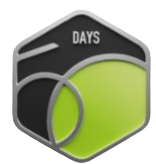
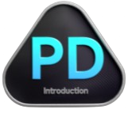

  <h2>🌐 Socials</h2>
  
  <a href="https://instagram.com/mohnishmj">
  
</a>

  

  <h2>💻 Tech Stack</h2>
  
  
  
  
  
  
  
  
  
  
  
  
  
  
  
  
  
  
  
  
  
  
  
  
  
  
  
  
  
  
  

  

  <h2>🏆 Leetcode Badges</h2>

  
  
  

